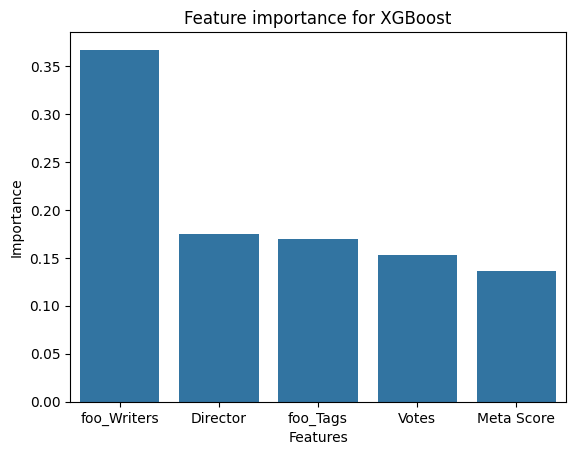
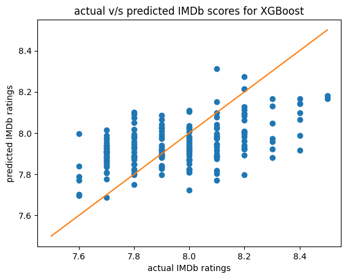

# IMDb Movie Rating Prediction: A Machine Learning Case Study

This project is an end-to-end data analysis and machine learning pipeline that predicts the IMDb rating of a movie based on its features. The goal was not only to build an accurate model but to identify the key drivers that contribute to a film's critical and commercial reception.

The project demonstrates a complete workflow, from initial data cleaning and exploratory analysis to advanced feature engineering, model training, and deployment in an interactive web application.

**Key Achievement:** A significant part of this project involved identifying and correcting two subtle forms of **data leakage**, which led to a robust and methodologically sound final model. The final model, while having a modest R-squared, is highly accurate in its predictions, achieving a **Mean Absolute Percentage Error (MAPE) of only ~2%**.

---

## 🚀 Live Demo

**(Placeholder)**
*You can add the link to your deployed Streamlit application here once it's live.*

---

## 🛠️ Tech Stack

* **Data Analysis & Manipulation:** Python, Pandas, NumPy
* **Machine Learning:** Scikit-learn, XGBoost, Category Encoders
* **Data Visualization:** Matplotlib, Seaborn
* **Web App:** Streamlit
* **Model Persistence:** Joblib

---

## 📖 Project Workflow

The project followed a systematic, iterative workflow, mirroring a professional data science process.

1.  **Data Cleaning & Preparation:** The initial dataset was cleaned and preprocessed. This included converting data types, handling missing values, and using stateless transformations (like splitting string-based lists into Python lists) before any data splitting.

2.  **Exploratory Data Analysis (EDA):** Initial analysis revealed the dataset was heavily skewed towards modern films (post-2010) and that critic scores (Metacritic) and user scores (IMDb) showed a diverging trend over the years.

3.  **Feature Engineering & Pipeline Creation:**
    * A robust `scikit-learn` pipeline was built to handle all preprocessing steps.
    * A **custom transformer** was created to apply a `LeaveOneOutEncoder` to high-cardinality categorical features (`Director`, `Stars`, `Writers`, `Tags`). This was a key step in creating powerful predictive features.

4.  **Model Training & Iteration:**
    * Several models were tested, including Linear Regression, RandomForestRegressor, and XGBRegressor.
    * **Data Leakage Discovery:** The iterative process was crucial in identifying and fixing two major data leakage issues, which initially produced an unrealistic 99% R-squared score.
    * **Feature Selection:** Through experimentation, I discovered that removing the highest-cardinality features (`foo_Stars`, `foo_Writers`) reduced overfitting and improved the model's ability to generalize, boosting the honest R-squared score from ~19% to **~25%**.

5.  **Model Evaluation:** The final XGBoost model was evaluated using a suite of metrics to get a complete picture of its performance.

6.  **Deployment:** The final, trained pipeline was saved using `joblib` and integrated into an interactive Streamlit web application.

---

## 📊 Key Findings & Analysis

### Model Performance
The final model achieved the following performance on the unseen test set:

| Metric | Score | Interpretation |
| :--- | :--- | :--- |
| **R-squared** | ~25% | The model explains a respectable 25% of the variance in IMDb ratings, a strong result for a subjective social science problem. |
| **RMSE** | ~0.18 | The model's predictions are typically off by only 0.18 rating points. |
| **MAPE** | ~1.87% | On average, the model's prediction is only **1.87%** away from the actual score, demonstrating high practical accuracy. |

### Predicted vs. Actual Plot
This plot visually confirms the model's success. The predictions cluster tightly around the line of perfect prediction, validating the low error scores.



### Feature Importance
The most insightful finding was that **thoughtful feature engineering was more impactful than algorithm choice**. The target-encoded `foo_` features were the most powerful predictors, proving that the historical performance of a movie's cast, writers, and tags are key drivers of its rating.



---

## 🚀 How to Run the App Locally

1.  **Clone the repository:**
    ```bash
    git clone https://github.com/Somoman44/TopIMDbMovies.git
    cd TopIMDbMovies
    ```
2.  **Install the dependencies:**
    ```bash
    pip install -r requirements.txt
    ```
3.  **Run the Streamlit app:**
    ```bash
    streamlit run webpage.py
    ```
